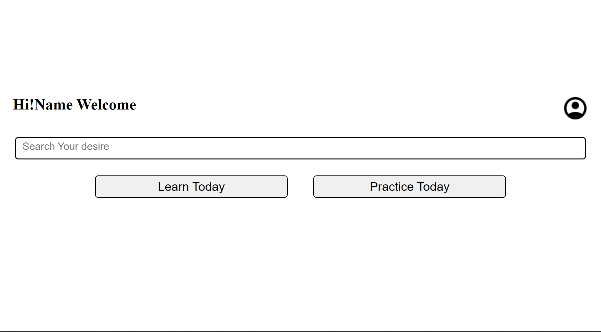

# Question-Bank

**Question Bank** is a repository for my project which is done by our team. It is a project where we have a demo of my website which does the same job as the name suggests, it is a question bank for college students who require previous year questions for their upcomming exams. In this project there are features to read questions and give practice tests too on several topics. It serves as a complete guide to get ready for any exam.

We want to give a tour of our demo project please be with us:

1. Welcome to our first page.This is the login/signup page of our website. To login use the mail address as `gmail:xyz@gmail.com` and for `password:12345` 
2. Now you are in our main page 
3. In main page we have four sections which are
   1. **Search section** Here you can search any type of question you like. On clicking it you can see a pop up will rise and there you are able to type any questions.
   2. **Learn section** Here you can learn any new or old topics according to your filters
   3. **Practice section** Here you can practice your previous knowledge on various topics
   4. **Profile section** Here you can access the profile,settings, and other sections.
      - By clicking the image you can get into the other sections
      - And by clicking the inner profile image you can come out from the section
4. If you clicked the learn section then you are now in the learn page 
   1. Here you can see many kind of filters to help you to reach the desire question for which you are in search for
   2. If you click the question 1 then you will be on the question-answer details page there you can read the answer and if you click on the plus button then you can add your answer either by typing or by adding a image to the question too.
5. If you clicked the practice section then you are now in the practice page 
   1. Here you can see many kind of filters to set a questions on your most wanted topics
   2. Here you also see many demo question papers if you click on the first one then you can go to the question paper and solve the questions

# Problems

As it is a demo project so many pages are under construction, For the lack of our knowledge there are bugs in this project

1. One of the bugs which we have recognized is "positioning issue for this problem different zoom labels see the page differently".

   - **To solve this please set the page according to your liking**

2. We don't have good UI too.
3. Due to our lack of knowledge on college exams and other things, for this many of the filters are still empty.
