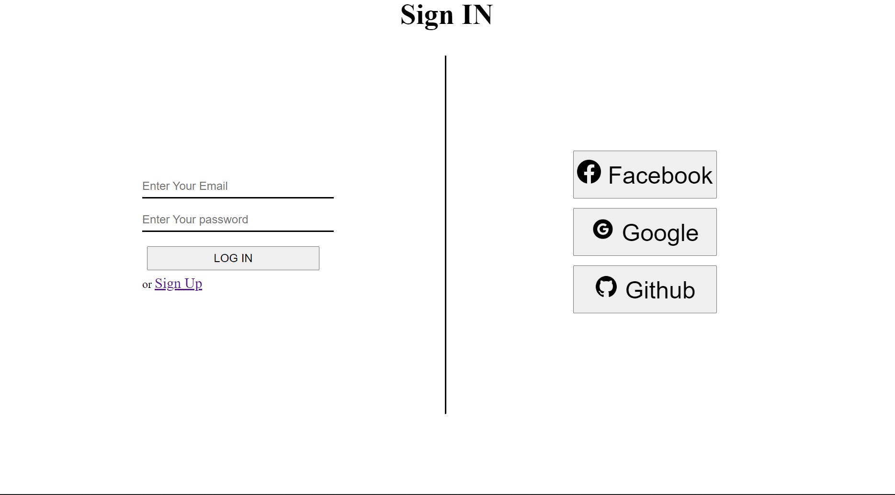
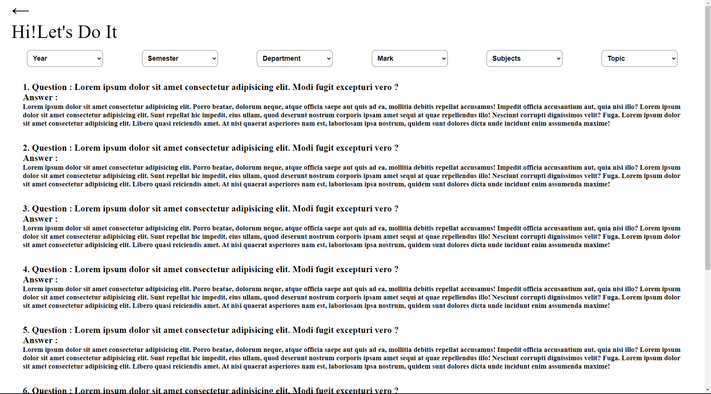

# Question-Bank

**Question Bank** is a repository for my project which is done by our team. It is a project where we have a demo of my website which does the same job as the name suggests, it is a question bank for college students who require previous year questions for their upcomming exams. In this project there are features to read questions and give practice tests too on several topics. It serves as a complete guide to get ready for any exam.

_"To view the actual website please click on the green coloured **CODE** button at right hand top portion. From there please download the zip file. A zip file named **Question-Bank-master** will be donloaded. After downloading please unzip it and open the Question-Bank-master folder. There you will find "**index.html**" clicking which, our actual website will get opened"_

We want to give a tour of our demo project please be with us:

**Please zoom the page according to the your liking. WE RECOMMEND TO ZOOM OUT TO SEE ALL THE TABS AND CONTENTS**

1. Welcome to our first page.This is the login/signup page of our website. To login use the mail address as `xyz@gmail.com` and for password use `12345` 
2. Now this is our main page. 
3. In main page we have four sections which are
   1. **Search section** Here you can search any type of question you like. On clicking it you can see a drop down menu will appear and in the search bar you will be able to any type of question you want.
   2. In the **Learn Today** section you will find several questions. You can also find the appropriate type of questions you want using the filters present there.
   3. In the **Practice Today** section you can practice on various years papers according to your wish. You can find the the paper of exact department, semester, year etc. according to your wish.
   4. In the **Profile icon** at the top right you can access the profile, settings, about us and also logout.
      - By clicking the profile icon you can get into the options of the profile menu and see the options present there.
      - And by clicking the profile image inside the menu you can come out from the section.
4. If you click the **"Learn Today"** tab then you will be in the **"Hi!Let's Do It"** page. 
   1. Here you will find several questions present there. You can find the appropriate type of questions you want using the filters present there.
   2. If you click the Question 1 then you will be on the question and answer details page where you can read the answer. There is a '+' icon at the right bottom corner of the page(please zoom out to find it). The plus button will enable a user to add any answer he/she wishes either by typing or by adding an image.
5. If you clicked the **"Practice Today"** tab then you are now in the **"Exam Time"** page. 
   1. Here you can give exam on any of the papers present. You can find the paper you want to give exam on with the help of the filters present.
   2. Here you also see many demo question papers.
   3. On clicking on the first paper **"Paper-1"** you will be able to see the questions. 
   4. On clicking the answer tab of any particular question you will be able to see the answer of it(not updated yet).
   5. At the right hand top corner of it the **Time** and **Marks** obtained will alse be showed.
   6. If anyone clicks on the back icon at the left hand top corner of the page knowingly or unknowingly then it dosen't get back at once but it shows a confirmation tab to **Quit** or to **Continue**.

# Problems

As it is a rough project so many pages are under construction. Because of our limited knowledge there are some bugs in this project. Some are:

1. One of the bugs which we have recognized is that each page at each zoom percentage works differently and all the contents of it are not shown properly. There is some positoning issue of the tabs as the move away to an inappropriate position when they are at different zoom levels. So presently you need to zoom accordingly to see all the contents of the website.
2. We don't have good UI too.
3. Due to our lack of knowledge in college exams and other things. For this reason many of the filters are still empty.
4. We still don't have the database of all questions or any previous year question papers and any solution of it, which is very much required. And the sample questions and answers needs to be updated with the actual ones.

                                       --THANK YOU, HOPE THE JUDGES WILL LIKE OUR PROJECT--
